# 🟣 Agentic Productivity System with MCP

> Cognitive executive assistant with persistent memory, multimodal processing, and sub-agent orchestration via MCP Protocol.

[](https://n8n.io)
[](https://telegram.org)
[](https://postgresql.org)
[]()

---

## 📋 Overview


**Mira** is an AI-based orchestrator that centralizes Google Workspace services (Calendar, Tasks, Gmail) and financial management into a conversational interface on Telegram. The system implements a cognitive architecture inspired by the human memory model, featuring sensory processing, short-term memory, and consolidation into long-term memory.

### Key Capabilities

* 🧠 **Cognitive Architecture**: Clear separation between sensory, short-term, and long-term memory.
* 🎙️ **Multimodal**: Processes text, audio, images, and documents via Google Gemini 2.0.
* 🔒 **Guardrails**: Detection of NSFW content and jailbreak attempts.
* 🔧 **MCP Protocol**: Specialized sub-agents for specific tasks.
* 📊 **RAG System**: Retrieval-Augmented Generation with Supabase Vector Store.
* ⚡ **Smart Buffer**: Message aggregation for conversational context preservation.

---

## 🏗️ System Architecture

### High-Level Overview

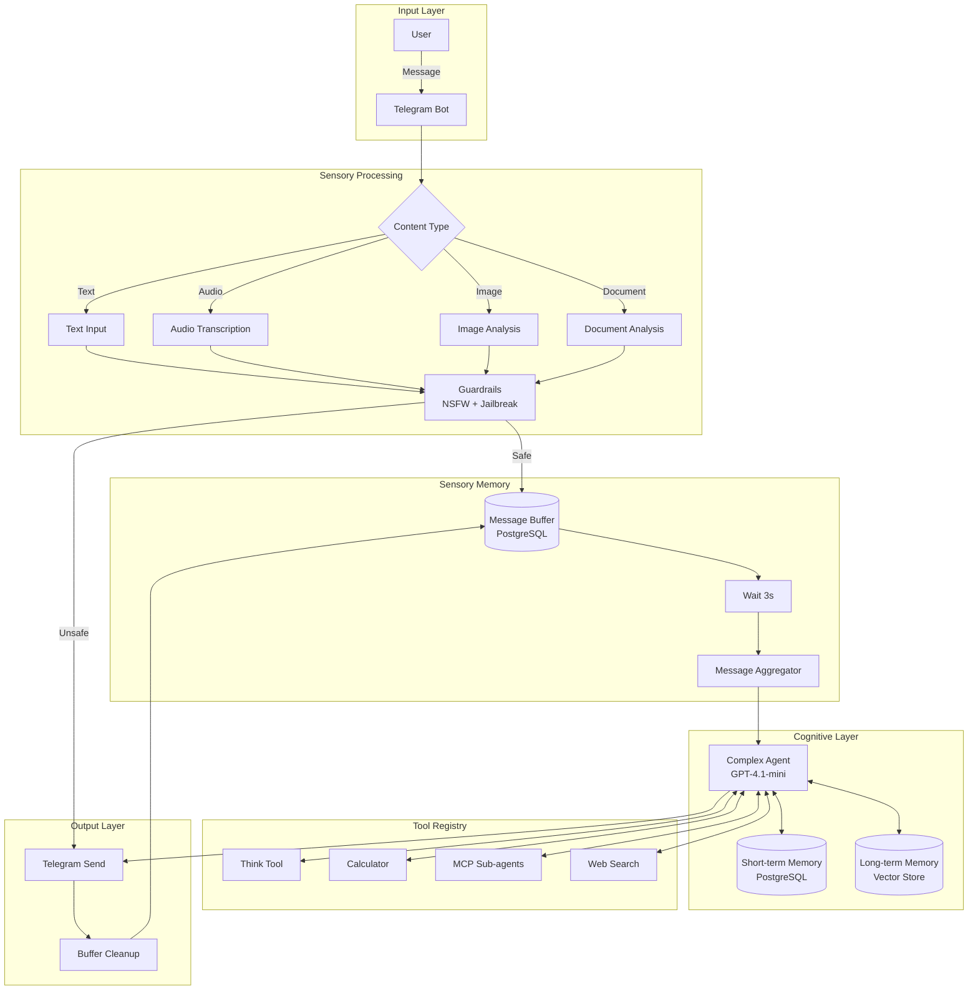

---

## 🧩 Technical Components

### 1. Sensory Layer (Input Processing)


**Responsibility**: Identification and normalization of multimodal inputs.

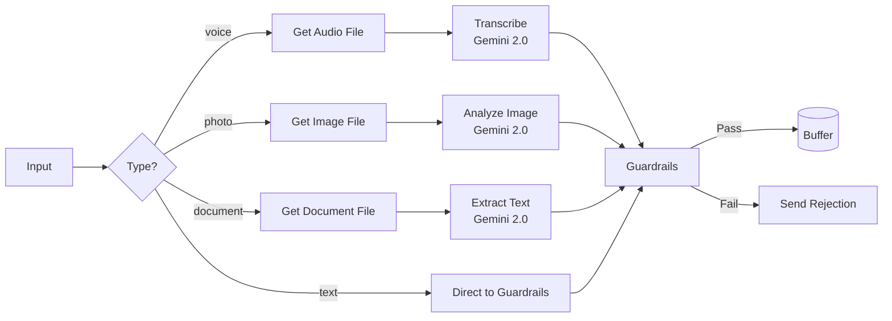

**Stack:**

* **Google Gemini 2.0 Flash**: Audio transcription, image analysis, and document extraction.
* **Llama 3.1 70B**: Guardrails (NSFW detection, jailbreak prevention).
* **Threshold**: 0.7 for both guardrails.

**Metrics:**

* Average Latency: 800ms - 1.5s
* Accuracy (guardrails): ~94%

---

### 2. Sensory Memory (Message Buffer)


**Responsibility**: Aggregation of sequential messages to build context.

**Algorithm:**

```sql
-- 1. Insert into buffer
INSERT INTO message_buffer (chat_id, content, batch_id)
VALUES ($chat_id, $content, NULL);

-- 2. Wait 3 seconds (allows for multiple incoming messages)

-- 3. Atomic marking with batch_id
UPDATE message_buffer
SET batch_id = $execution_id
WHERE chat_id = $chat_id 
  AND batch_id IS NULL
RETURNING content;

-- 4. Aggregation
SELECT STRING_AGG(content, '\n' ORDER BY id) as full_context
FROM message_buffer
WHERE batch_id = $execution_id;

-- 5. Post-processing Cleanup
DELETE FROM message_buffer WHERE batch_id = $execution_id;

```

**Advantages:**

* ✅ **Atomicity**: Usage of `batch_id` prevents race conditions.
* ✅ **Context Window**: Multiple messages within ~3s are processed together.
* ✅ **Automatic Cleanup**: Buffer is cleared after each cycle.

---

### 3. Cognitive Layer (Agent + Memory)

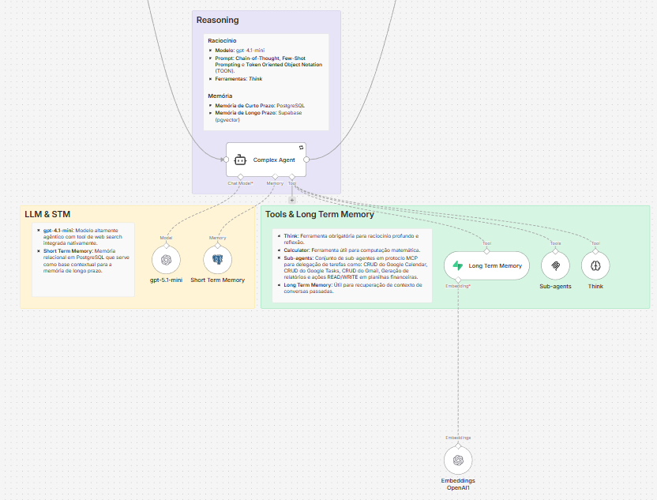

#### Agent Architecture

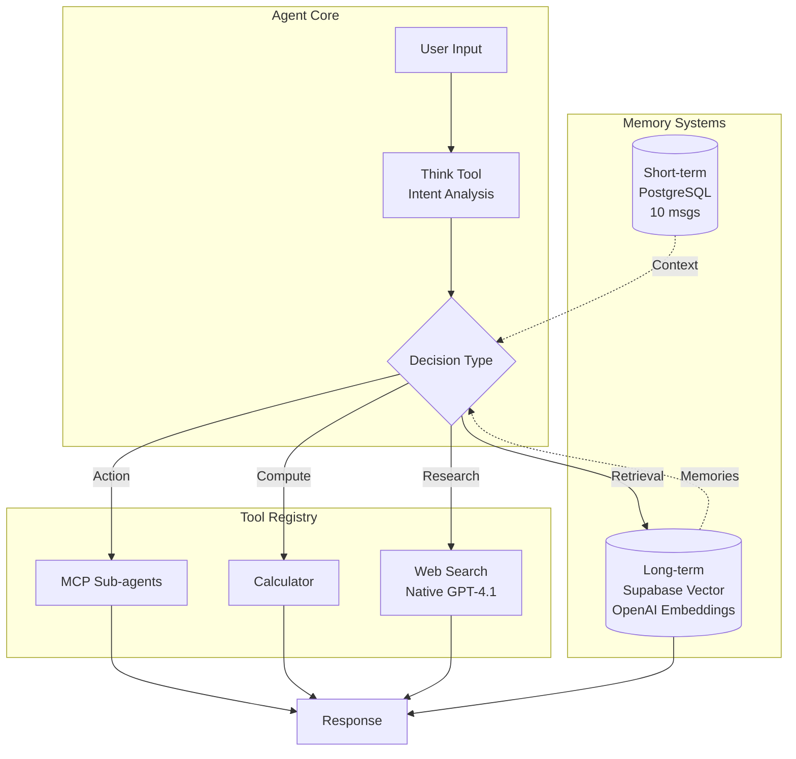

**Model:** GPT-4.1-mini (gpt-5.1)

* **Context Window**: 10 messages (Short-term Memory).
* **Temperature**: Default (0.7).
* **Built-in**: Web Search (medium context).

#### Prompt Engineering

**Applied Strategies:**

1. **Chain-of-Thought (CoT)**: Mandatory `think` tool for explicit reasoning.
2. **Few-Shot Learning**: Interaction examples embedded in the system prompt.
3. **TOON (Token Oriented Object Notation)**: Hierarchical prompt structuring.
4. **Tool Calling**: Decision-making based on intent analysis.

**System Prompt Structure:**

```
🟣 SYSTEM_IDENTITY
🟣 CONTEXT_VARIABLES (date, time, user)
🟣 GLOBAL_CONSTRAINTS (formatting, data integrity)
🟣 DECISION_PROTOCOL (priority order)
🟣 TOOL_REGISTRY (tech specs)
🟣 ORCHESTRATION_PROTOCOL (workflow)
🟣 FEW_SHOT_EXAMPLES

```

---

### 4. Memory Systems

#### Short-term Memory (Working Memory)

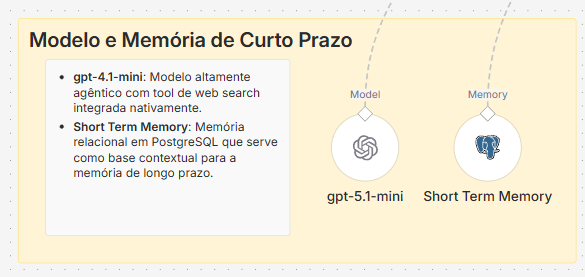

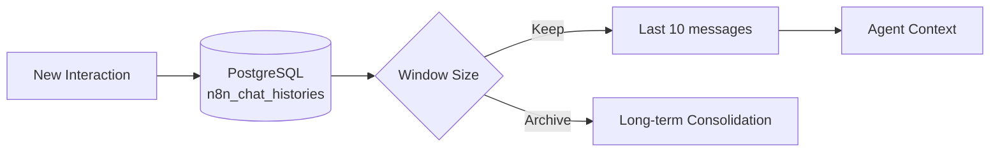

**Schema:**

```sql
CREATE TABLE n8n_chat_histories (
    id SERIAL PRIMARY KEY,
    session_id VARCHAR(255),
    message JSONB,
    created_at TIMESTAMP DEFAULT NOW()
);

```

**Retention Policy:**

* **Active Window**: Last 10 messages.
* **Cleanup**: Messages > 30 days are deleted (monthly cron).

#### Long-term Memory (Episodic Memory)


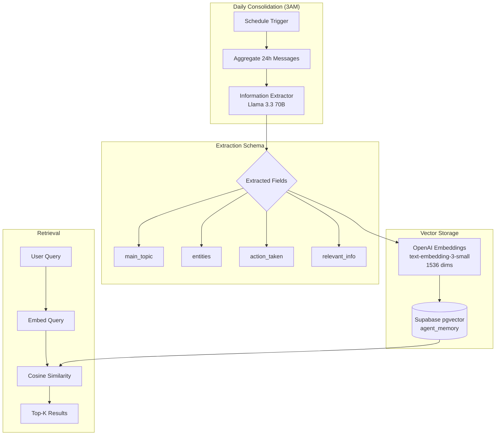

**Consolidation Query:**

```sql
-- 24h Aggregation
SELECT STRING_AGG(message->>'content', E'\n' ORDER BY id) as batch
FROM n8n_chat_histories
WHERE created_at > NOW() - INTERVAL '1 day';

```

**Vector Store Schema:**

```sql
CREATE TABLE agent_memory (
    id BIGSERIAL PRIMARY KEY,
    content TEXT,
    metadata JSONB,
    embedding VECTOR(1536)
);

CREATE INDEX ON agent_memory 
USING ivfflat (embedding vector_cosine_ops)
WITH (lists = 100);

```

**Retrieval Strategy:**

* **Embedding Model**: `text-embedding-3-small` (OpenAI).
* **Distance Metric**: Cosine Similarity.
* **Top-K**: 5 results.
* **Metadata Filtering**: `chat_id`, `date_range`.

---

### 5. MCP Sub-agents (Task Delegation)

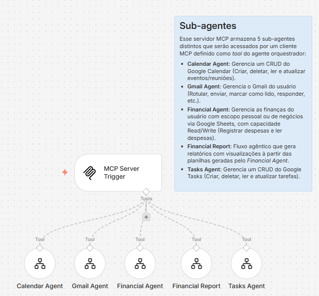

**MCP Protocol**: Model Context Protocol used for communication between the main agent and specialized sub-agents.

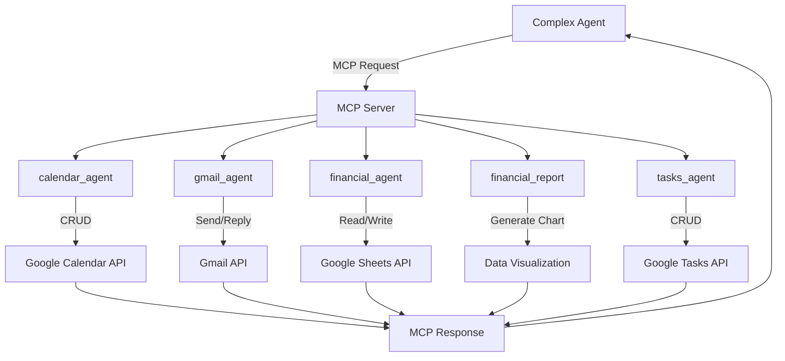

**Sub-agents Specs:**

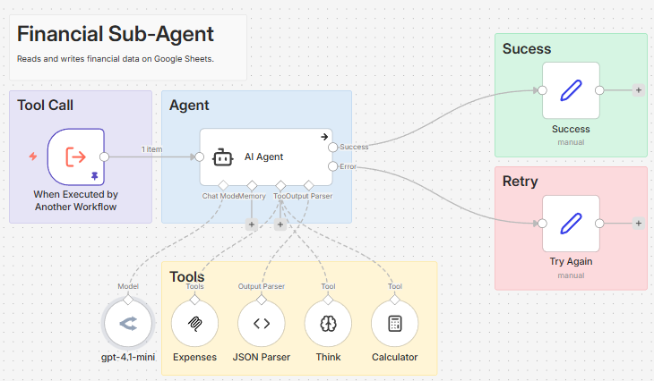

| Agent | Capabilities | API | Scope |
| --- | --- | --- | --- |
| `calendar_agent` | CRUD events, list, search | Google Calendar | - |
| `gmail_agent` | Send, reply, label, search | Gmail | - |
| `financial_agent` | Log expenses, read balance | Google Sheets | `personal or business` |
| `financial_report` | Generate charts, summaries | Google Sheets + Chart.js | `personal or business` |
| `tasks_agent` | CRUD tasks, mark complete | Google Tasks | - |

**MCP Call Example:**

```json
{
  "tool": "sub_agents",
  "params": {
    "agent": "calendar_agent",
    "prompt": "Schedule meeting with Ana on Jan 15th, 2026 at 2 PM",
    "scope": null
  }
}

```

**Response Handling:**

* **Success**: Sub-agent returns a structured confirmation.
* **Failure**: Automatic retry (max 2 attempts).
* **Media Output**: `financial_report` returns an image (bypassing text generation).

---

### Error Handling

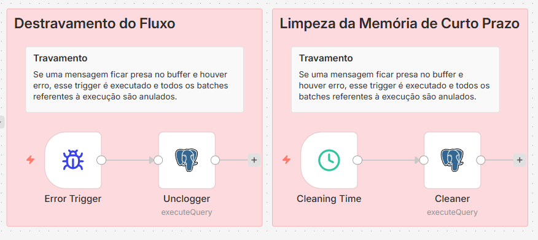

This system implements a robust error handling mechanism to ensure continuous execution and explicit recovery. Specifically, it uses an **Error Trigger** in n8n to detect failures and unblock the current flow state.

#### Implemented Error Flows

##### 1. Flow Unblocking Mechanism

An **Error Trigger** is activated if a problem occurs in the execution associated with the `message_buffer`. The flow voids the current batch to prevent deadlocks and reprocesses messages:

Flow:

1. **Trigger**: Detects error event.
2. **Unclogger**: Removes `batch_id` from `message_buffer` using the following SQL:
```sql
UPDATE message_buffer
SET batch_id = NULL
WHERE batch_id = '{{ $execution.id }}';

```


This process ensures no message remains locked, allowing new executions for the affected flow.

##### 2. Short-Term Memory Cleanup

A regularly scheduled job (**Scheduled Trigger**) deletes obsolete records (interactions older than 30 days):

Flow:

1. **Trigger**: Runs monthly at 3:00 AM.
2. **Cleaner**: Executes the following command:
```sql
DELETE FROM n8n_chat_histories 
WHERE created_at < NOW() - INTERVAL '30 days';

```


This ensures optimal performance by preserving only the relevant window for `STM` operations.

---

## 📊 Performance & Metrics

### Latency Breakdown

```mermaid
gantt
    title Execution Timeline (without tools)
    dateFormat SSS
    section Input
    Sensory Processing    :000, 800ms
    Guardrails Check      :800, 400ms
    section Buffer
    Wait Period           :1200, 3000ms
    Message Aggregation   :4200, 200ms
    section Cognitive
    Agent Processing      :4400, 2000ms
    section Output
    Telegram Send         :6400, 300ms

```

| Scenario | Latency | Tokens | Cost (estimated) |
| --- | --- | --- | --- |
| Simple text (no tools) | ~3s | 1k-3k | $0.001-0.003 |
| Text + tool calling | ~7s-10s | 4k-15k | $0.004-0.015 |

### Memory Statistics

* **Short-term Window**: 10 messages (rolling).
* **Long-term Storage**: ~30 memories/month.

---

## 🔧 Tech Stack

### Core Infrastructure

* **Orchestration**: n8n (self-hosted)
* **Database**: PostgreSQL 15 + pgvector
* **Vector Store**: Supabase (managed)
* **Hosting**: Hostinger

### AI Models

| Component | Model | Provider | Purpose |
| --- | --- | --- | --- |
| Main Agent | GPT-4.1-mini | OpenAI | Cognitive orchestration |
| Transcription | Gemini 2.0 Flash | Google | Audio → Text |
| Image Analysis | Gemini 2.0 Flash | Google | Vision → Text |
| Document Analysis | Gemini 2.0 Flash | Google | PDF/Doc → Text |
| Guardrails | Llama 3.1 70B | OpenRouter | Safety checks |
| Memory Extraction | Llama 3.3 70B | OpenRouter | Information extraction |
| Embeddings | text-embedding-3-small | OpenAI | Vector generation |

### Integrations

* **Telegram Bot API**: User interface
* **Google Cloud Platform**:
* Calendar API
* Gmail API
* Tasks API
* Sheets API


* **MCP Protocol**: Custom sub-agent server

---

## 🚀 Use Cases

### 1. Agenda Management

```
👤 User: "Lunch with Ana tomorrow at 1 PM"
🟣 Mira: [Calls calendar_agent]
       "Done! Scheduled Lunch with Ana 
        for tomorrow (Jan 15) at 1 PM. ✅"

```

### 2. Financial Control

```
👤 User: "Spent $50 on lunch"
🟣 Mira: "Was this Personal or Business expense?"
👤 User: "Business"
🟣 Mira: [Calls financial_agent]
       "Logged! 💰 $50.00 (Business - Food)"

```

### 3. Visual Reporting

```
👤 User: "How much did I spend this month?"
🟣 Mira: "Do you want the Personal or Business report?"
👤 User: "Personal"
🟣 Mira: [Calls financial_report]
       [Sends PNG chart via Telegram]

```

### 4. Context Retrieval

```
👤 User: "What did I agree with Carlos in the last meeting?"
🟣 Mira: [Searches long-term memory]
       "In the meeting on Jan 10th, you agreed with Carlos to:
        • Deliver the proposal by Jan 20th
        • Review the cost spreadsheet
        • Next meeting: Jan 25th at 3 PM"

```

---

## 📄 Full Technical Documentation

This README presents the high-level architecture of the project. For access to the complete technical documentation, including:

* 🔧 Setup guide with mock credentials
* 📊 Detailed cost analysis
* 🎥 Video demos of use cases
* 📝 Sanitized Workflow JSON
* 🧪 Performance tests

**Contact me** via codeajr@gmail.com.

---

## 🤝 Contributions

This is a proprietary project developed for personal/commercial use. The full source code is not publicly available, but technical suggestions and discussions are welcome via Issues.

---

## 📝 License

**Proprietary License** - All rights reserved.

This project is confidential and contains proprietary integrations. This documentation is shared solely for technical portfolio purposes.

---

## 👤 Author

**André Codea**

* LinkedIn: [https://linkedin.com/in/andrecodea](https://linkedin.com/in/andrecodea)
* GitHub: [https://github.com/andrecodea](https://github.com/andrecodea)
* Email: codeajr@gmail.com

---

<p align="center">
<i>Built with ❤️ using n8n, OpenAI, and lots of ☕</i>
</p>
