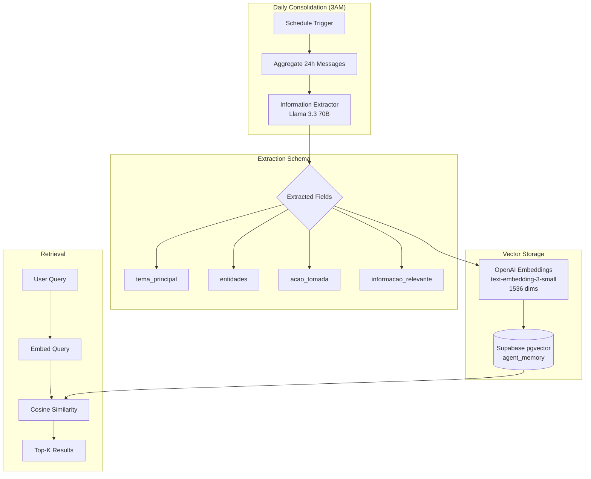

# 🟣 Agentic Productivity System with MCP
> Assistente executivo cognitivo com memória persistente, processamento multimodal e orquestração de sub-agentes via MCP Protocol.

[](https://n8n.io)
[](https://telegram.org)
[](https://postgresql.org)
[]()

---

## 📋 Visão Geral


**Mira** é a orquestradora baseada em IA que centraliza serviços do Google Workspace (Calendar, Tasks, Gmail) e gerenciamento financeiro em uma interface conversacional no Telegram. O sistema implementa uma arquitetura cognitiva inspirada no modelo de memória humana, com processamento sensorial, memória de curto prazo e consolidação para memória de longo prazo.


### Características Principais

- 🧠 **Arquitetura Cognitiva**: Separação clara entre sensory memory, short-term e long-term memory
- 🎙️ **Multimodal**: Processa texto, áudio, imagens e documentos via Google Gemini 2.0
- 🔒 **Guardrails**: Detecção de conteúdo NSFW e tentativas de jailbreak
- 🔧 **MCP Protocol**: Sub-agentes especializados para tarefas específicas
- 📊 **RAG System**: Retrieval-Augmented Generation com Supabase Vector Store
- ⚡ **Buffer Inteligente**: Agregação de mensagens para contexto conversacional

---

## 🏗️ Arquitetura do Sistema

### High-Level Overview


---

## 🧩 Componentes Técnicos

### 1. Sensory Layer (Input Processing)


**Responsabilidade**: Identificação e normalização de inputs multimodais.


**Stack:**
- **Google Gemini 2.0 Flash**: Transcrição de áudio, análise de imagens e extração de documentos
- **Llama 3.1 70B**: Guardrails (NSFW detection, jailbreak prevention)
- **Threshold**: 0.7 para ambos os guardrails

**Métricas:**
- Latência média: 800ms - 1.5s
- Accuracy (guardrails): ~94%

---

### 2. Sensory Memory (Message Buffer)


**Responsabilidade**: Agregação de mensagens sequenciais para construção de contexto.

**Algoritmo:**
```sql
-- 1. Inserção no buffer
INSERT INTO message_buffer (chat_id, content, batch_id)
VALUES ($chat_id, $content, NULL);

-- 2. Wait 3 segundos (permite múltiplas mensagens)

-- 3. Marcação atômica com batch_id
UPDATE message_buffer
SET batch_id = $execution_id
WHERE chat_id = $chat_id 
  AND batch_id IS NULL
RETURNING content;

-- 4. Agregação
SELECT STRING_AGG(content, '\n' ORDER BY id) as full_context
FROM message_buffer
WHERE batch_id = $execution_id;

-- 5. Limpeza pós-processamento
DELETE FROM message_buffer WHERE batch_id = $execution_id;
```

**Vantagens:**
- ✅ **Atomicidade**: Uso de `batch_id` evita race conditions
- ✅ **Context Window**: Múltiplas mensagens em ~3s são processadas juntas
- ✅ **Cleanup Automático**: Buffer limpo após cada ciclo

---

### 3. Cognitive Layer (Agent + Memory)


#### Agent Architecture


**Model:** GPT-4.1-mini (gpt-5.1)
- **Context Window**: 10 mensagens (Short-term Memory)
- **Temperature**: Default (0.7)
- **Built-in**: Web Search (medium context)

#### Prompt Engineering

**Estratégias aplicadas:**
1. **Chain-of-Thought (CoT)**: Tool `think` obrigatória para raciocínio explícito
2. **Few-Shot Learning**: Exemplos de interações no system prompt
3. **TOON (Token Oriented Object Notation)**: Estruturação hierárquica do prompt
4. **Tool Calling**: Decisão baseada em intent analysis

**System Prompt Structure:**
```
🟣 SYSTEM_IDENTITY
🟣 CONTEXT_VARIABLES (date, time, user)
🟣 GLOBAL_CONSTRAINTS (formatting, data integrity)
🟣 DECISION_PROTOCOL (priority order)
🟣 TOOL_REGISTRY (specs técnicas)
🟣 ORCHESTRATION_PROTOCOL (workflow)
🟣 FEW_SHOT_EXAMPLES
```

---

### 4. Memory Systems

#### Short-term Memory (Working Memory)


**Schema:**
```sql
CREATE TABLE n8n_chat_histories (
    id SERIAL PRIMARY KEY,
    session_id VARCHAR(255),
    message JSONB,
    created_at TIMESTAMP DEFAULT NOW()
);
```

**Política de Retenção:**
- **Active Window**: 10 últimas mensagens
- **Cleanup**: Mensagens > 30 dias deletadas (monthly cron)

#### Long-term Memory (Episodic Memory)




**Consolidation Query:**
```sql
-- Agregação de 24h
SELECT STRING_AGG(message->>'content', E'\n' ORDER BY id) as batch
FROM n8n_chat_histories
WHERE created_at > NOW() - INTERVAL '1 day';
```

**Vector Store Schema:**
```sql
CREATE TABLE agent_memory (
    id BIGSERIAL PRIMARY KEY,
    content TEXT,
    metadata JSONB,
    embedding VECTOR(1536)
);

CREATE INDEX ON agent_memory 
USING ivfflat (embedding vector_cosine_ops)
WITH (lists = 100);
```

**Retrieval Strategy:**
- **Embedding Model**: `text-embedding-3-small` (OpenAI)
- **Distance Metric**: Cosine Similarity
- **Top-K**: 5 results
- **Metadata Filtering**: `chat_id`, `date_range`

---

### 5. MCP Sub-agents (Task Delegation)


**MCP Protocol**: Model Context Protocol para comunicação entre agente principal e sub-agentes especializados.


**Sub-agents Specs:**


| Agent | Capabilities | API | Scope |
|-------|-------------|-----|-------|
| `calendar_agent` | CRUD events, list, search | Google Calendar | - |
| `gmail_agent` | Send, reply, label, search | Gmail | - |
| `financial_agent` | Log expenses, read balance | Google Sheets | `personal` \| `business` |
| `financial_report` | Generate charts, summaries | Google Sheets + Chart.js | `personal` \| `business` |
| `tasks_agent` | CRUD tasks, mark complete | Google Tasks | - |

**MCP Call Example:**
```json
{
  "tool": "sub_agents",
  "params": {
    "agent": "calendar_agent",
    "prompt": "Agendar reunião com Ana dia 15/01/2026 às 14h",
    "scope": null
  }
}
```

**Response Handling:**
- **Success**: Sub-agent retorna confirmação estruturada
- **Failure**: Retry automático (max 2 tentativas)
- **Media Output**: `financial_report` retorna imagem (bypassa texto)

---

## 📊 Performance & Metrics

### Latency Breakdown


| Cenário | Latência | Tokens | Custo (estimado) |
|---------|----------|--------|------------------|
| Texto simples (sem tools) | ~3s | 1k-3k | $0.001-0.003 |
| Texto + tool calling  | ~7s-10s | 4k-15k | $0.004-0.015 |

### Memory Statistics
- **Short-term Window**: 10 mensagens (rolling)
- **Long-term Storage**: ~30 memories/mês

---

## 🔧 Stack Técnica

### Core Infrastructure
- **Orchestration**: n8n (self-hosted)
- **Database**: PostgreSQL 15 + pgvector
- **Vector Store**: Supabase (managed)
- **Hosting**: Hostinger

### AI Models
| Component | Model | Provider | Purpose |
|-----------|-------|----------|---------|
| Main Agent | GPT-4.1-mini | OpenAI | Cognitive orchestration |
| Transcription | Gemini 2.0 Flash | Google | Audio → Text |
| Image Analysis | Gemini 2.0 Flash | Google | Vision → Text |
| Document Analysis | Gemini 2.0 Flash | Google | PDF/Doc → Text |
| Guardrails | Llama 3.1 70B | OpenRouter | Safety checks |
| Memory Extraction | Llama 3.3 70B | OpenRouter | Information extraction |
| Embeddings | text-embedding-3-small | OpenAI | Vector generation |

### Integrations
- **Telegram Bot API**: User interface
- **Google Cloud Platform**:
  - Calendar API
  - Gmail API
  - Tasks API
  - Sheets API
- **MCP Protocol**: Custom sub-agent server

---

## 🚀 Casos de Uso

### 1. Gestão de Agenda
```
👤 User: "Almoço com a Ana amanhã 13h"
🟣 Mira: [Calls calendar_agent]
       "Combinado! Agendei seu Almoço com a Ana 
        para amanhã (15/01) às 13h. ✅"
```

### 2. Controle Financeiro
```
👤 User: "Gastei 50 reais no almoço"
🟣 Mira: "Esse gasto foi Pessoal ou da Empresa?"
👤 User: "Foi da empresa"
🟣 Mira: [Calls financial_agent]
       "Registrado! 💰 R$ 50,00 (Empresa - Alimentação)"
```

### 3. Relatórios Visuais
```
👤 User: "Quanto gastei esse mês?"
🟣 Mira: "Você quer o relatório Pessoal ou de Negócios?"
👤 User: "Pessoal"
🟣 Mira: [Calls financial_report]
       [Envia gráfico PNG via Telegram]
```

### 4. Recuperação de Contexto
```
👤 User: "O que eu combinei com o Carlos na reunião passada?"
🟣 Mira: [Searches long-term memory]
       "Na reunião de 10/01 você combinou com o Carlos:
        • Entregar proposta até 20/01
        • Revisar planilha de custos
        • Próxima reunião: 25/01 às 15h"
```

---

## 📄 Documentação Técnica Completa

Este README apresenta a arquitetura high-level do projeto. Para acesso à documentação técnica completa, incluindo:

- 🔧 Setup guide com credenciais mock
- 📊 Análise de custos detalhada
- 🎥 Video demos de casos de uso
- 📝 Workflow JSON sanitizado
- 🧪 Testes de performance

**Entre em contato** via codeajr@gmail.com.

---

## 🤝 Contribuições

Este é um projeto proprietário desenvolvido para uso pessoal/comercial. O código-fonte completo não está disponível publicamente, mas sugestões e discussões técnicas são bem-vindas via Issues.

---

## 📝 Licença

**Proprietary License** - Todos os direitos reservados.

Este projeto é confidencial e contém integrações proprietárias. A documentação é compartilhada apenas para fins de portfolio técnico.

---

## 👤 Autor

**André Codea**
- LinkedIn: https://linkedin.com/in/andrecodea
- GitHub: https://github.com/andrecodea
- Email: codeajr@gmail.com

---

<p align="center">
  <i>Built with ❤️ using n8n, OpenAI, and lots of ☕</i>
</p>
